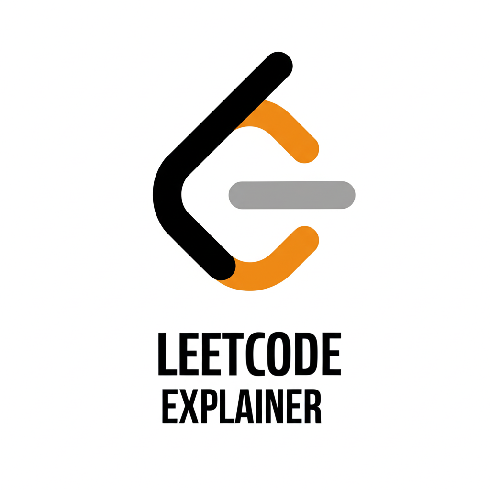

# LeetCode Explainer ✨

A Chrome extension that uses the Google Gemini API to provide clear explanations for LeetCode problems. Get simple summaries, detailed breakdowns, or real-world analogies directly on the problem page.

## Features

-   **Multiple Explanation Styles**: Choose the type of explanation that works best for you:
    -   **Simple Explanation**: A concise, 2-3 sentence summary of the problem's goal.
    -   **Detailed Breakdown**: A structured analysis of inputs, outputs, constraints, and edge cases.
    -   **Real-World Analogy**: Understand the problem through a simple, relatable comparison.
-   **Seamless Integration**: Works directly on LeetCode problem pages (`https://leetcode.com/problems/*`).
-   **Sleek UI**: A modern, LeetCode-inspired dark theme with glassmorphism effects.
-   **Easy Setup**: Prompts for an API key on first installation.
-   **Copy to Clipboard**: Easily copy the generated explanation for your notes.

---

## Installation

To install this extension locally:

1.  **Download or Clone**: Download this repository as a ZIP file and unzip it, or clone it using Git.
2.  **Open Chrome Extensions**: Open Google Chrome and navigate to `chrome://extensions`.
3.  **Enable Developer Mode**: In the top-right corner, turn on the "Developer mode" toggle.
4.  **Load the Extension**:
    * Click the **"Load unpacked"** button that appears on the top-left.
    * Select the folder where you unzipped or cloned the repository.
5.  The **LeetCode Explainer** icon should now appear in your Chrome toolbar!

---

## How to Use

1.  **Get a Gemini API Key**:
    * You need a free API key from **Google AI Studio**.
2.  **Set Your API Key**:
    * Upon first installation, the extension will automatically open an options page for you to enter your key.
    * If you need to change it later, right-click the extension icon and select "Options.".
    * Paste your key into the input field and click **"Save & Close"**.
3.  **Get Explanations**:
    * Navigate to any LeetCode problem page (e.g., `https://leetcode.com/problems/two-sum/`).
    * Click the **LeetCode Explainer** icon in your Chrome toolbar to open the popup.
    * Select your desired explanation type from the dropdown menu.
    * Click **"Explain Problem"**. The explanation will appear in the result box below.

---

## How It Works

This extension is built using Manifest V3 for Chrome extensions and the Google Gemini API.

-   When you're on a LeetCode problem page, the `content.js` script is able to access and extract the problem's title, description, and examples from the page's HTML.
-   When you click "Explain Problem" in the popup, `popup.js` sends a message to the content script to get that text.
-   `popup.js` then takes the problem text, combines it with a carefully crafted prompt based on your selected explanation type, and sends it to the Gemini API (`gemini-1.5-flash` model) using your saved API key.
-   The AI-generated explanation is streamed back and displayed in the popup's result area.

---

## File Breakdown

-   `manifest.json`: The core file that defines the extension's permissions, scripts, and properties.
-   `popup.html`: The HTML structure for the main popup window.
-   `options.html`: The HTML for the settings page where the user saves their API key.
-   `styles.css`: Contains all styling for the popup and options page, creating the dark, LeetCode-inspired theme.
-   `popup.js`: Handles the logic for the popup, including getting problem text, calling the Gemini API, and displaying results.
-   `options.js`: Saves the user's Gemini API key to Chrome's synchronized storage.
-   `content.js`: A content script that is injected into LeetCode problem pages to scrape the problem details.
-   `background.js`: A service worker that runs in the background. Its main job is to check if an API key exists on first install and open the options page if not.
-   `icon.png`: The icon for the extension.

improve heading size and all for readme file in github
